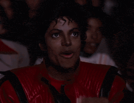
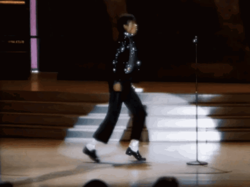
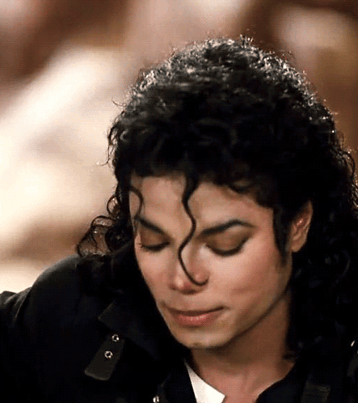

<p align="center">
  
</p>


<h1>
  Hi, I'm Darlyson Gabriel
  
</h1>


I'm a Brazilian developer focused on game development with Godot Engine and GDScript.

I enjoy creating gameplay systems, animated interfaces, visual effects, and small reusable projects to experiment with game development.

<h1>
  About me
  
</h1>

- 🎮 Game Developer
- 🔧 Godot Engine & GDScript
- 🎨 UI, animations, shaders & visual effects
- 🧩 Gameplay systems and reusable components
- 🐧 Linux user
- ☕ Member of Coffe Studio

# Featured Projects

## Godot UI Animation Samples

A collection of animated UI components, menu transitions and interface effects made with Godot Engine.

Focus:

- 🔘 Animated buttons
- 📋 Menu transitions
- 🪟 Panels and popups
- ✨ UI feedback
- 🎬 Screen transitions

🔗 [View Repository](https://github.com/DarlysonGabriel/godot-ui-animation-samples)


## 🏔️ Mountain Climbing

A 2D platform game about climbing a frozen mountain.

Engine: Godot
Language: GDScript
Studio: Coffe Studio

🔗 [View Repository](https://github.com/Coffe-Studio/mountain-climbing)


# Technologies

## 🎮 Game Development

- Godot Engine
- GDScript
- Construct 3

## 💻 Programming

- GDScript
- Python
- bash

## 🐧 Tools & Environment

- Linux
- Git
- GitHub
- VS Code


# Current Focus
```
GAME DEVELOPMENT
│
├── 🎮 Godot Engine
├── 🎨 UI & Animation
├── ⚙️ Gameplay Systems
├── ✨ Visual Effects
├── 🧩 Reusable Components
└── 🐧 Linux
```


# ☕ Coffe Studio

Coffe Studio is an independent game studio focused on creating original games and exploring different areas of game development.

Current Project


# 📚 What I'm Building

_Small, focused projects designed to learn, experiment and build practical experience._

My repositories cover different areas of game development, from UI animation and gameplay systems to graphics and development tools.


<h1>
  📫 Contact
  
</h1>


- 🐙 GitHub: [@DarlysonGabriel](https://github.com/DarlysonGabriel)
- 🌐 Website: [darlyson-gabriel-por-0vao.bolt.host](https://darlyson-gabriel-por-0vao.bolt.host/)
- 📧 Email: darlysongabriel.contato@gmail.com


